**Note:** For the screenshots, you can store all of your answer images in the `answer-img` directory.

## Verify the monitoring installation

Run `kubectl` command to show the running pods and services for all components. Take a screenshot of the output and include it here to verify the installation

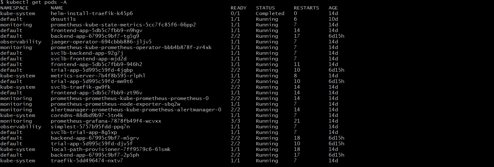
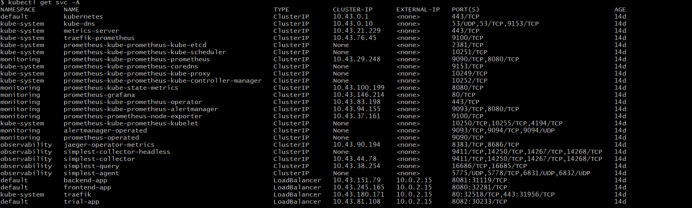

## Setup the Jaeger and Prometheus source
Expose Grafana to the internet and then setup Prometheus as a data source. Provide a screenshot of the home page after logging into Grafana.

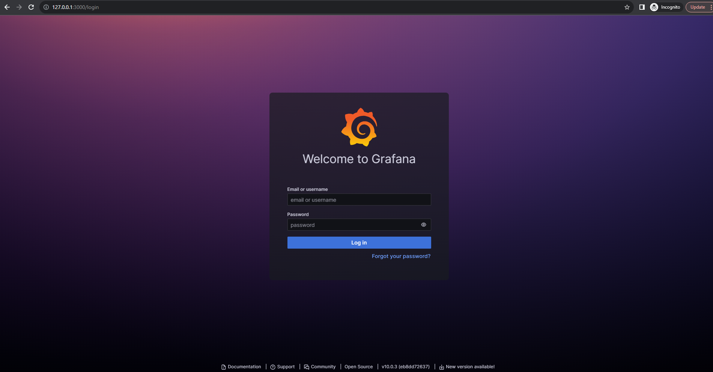
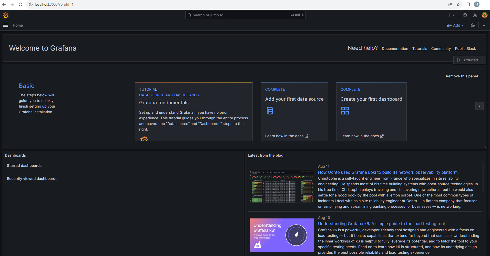

## Create a Basic Dashboard
Create a dashboard in Grafana that shows Prometheus as a source. Take a screenshot and include it here.

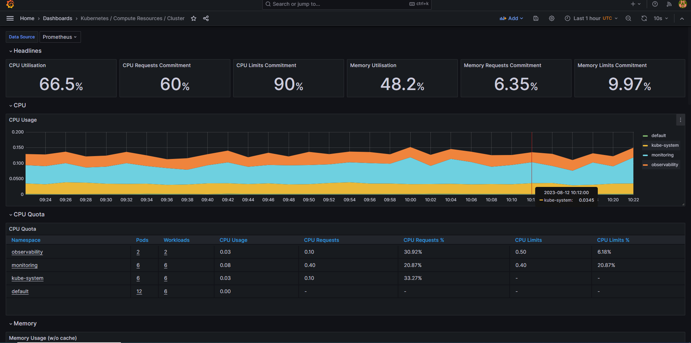

## Describe SLO/SLI
Describe, in your own words, what the SLIs are, based on an SLO of *monthly uptime* and *request response time*.

 * The Service Level Indicators (SLIs)are  indicators that measure the performance of the service or the application set by  the Service Level Objective (SLO). The SLIs help to evaluate whether the service is meeting its intendd targets and perfromance expectations. 
    * The SLIs, based on the monthly uptime,  measures the  percentage time a service or system is availabile within a month.  
    * The request response time, also known as latency, measure the average response time it takes for a system to process a user request and provide a response. 

## Creating SLI metrics.
It is important to know why we want to measure certain metrics for our customer. Describe in detail 5 metrics to measure these SLIs. 

**Latency/Response Time:** measures the ime it takes for a system to proces a request and provide a respons. It measure the speed of data transmisssion and procesing. Lower latency means quicker responses and  smoother user interactions, while higher latency can lead to delays and frustration.

**Error Rate:** It is the percentage of requests that result in errors or failures. It indicates the stability and reliabilty of a service. Monitoring error rate helps identify issues that imact user expereince and can help prioritize debugging efforts. A high error rate could indicate problems in code, infrastructure, or external dependencies.

**Network Traffic:** measures the volume of incoming requests or data to a service. monitoring traffic helps ensure that the service can handle varying level of load without degradiation in perforemcne. it is about ensuring your service can handle spikes in demand without slowdown.

**Resource Utilization (Satuaration):** measure how efficiently the system uses its available resources, such as CPU, memory, disk space, and network bandwidth. Monitoring resourcce utilization helps prevent bottleneck and enures optimal performace. High resource utilization can result in performnce issues or even system crashes. Proper utilization ensure smooth operations.

**Uptime:** measures the percentage of time a service is available and operational. It is a measure of relaibilty. It is esential for delivering a consistent user experiacne. Downtime, on the otherhand, indicates periods when the service is unavailable. 

## Create a Dashboard to measure our SLIs
Create a dashboard to measure the uptime of the frontend and backend services We will also want to measure to measure 40x and 50x errors. Create a dashboard that show these values over a 24 hour period and take a screenshot.

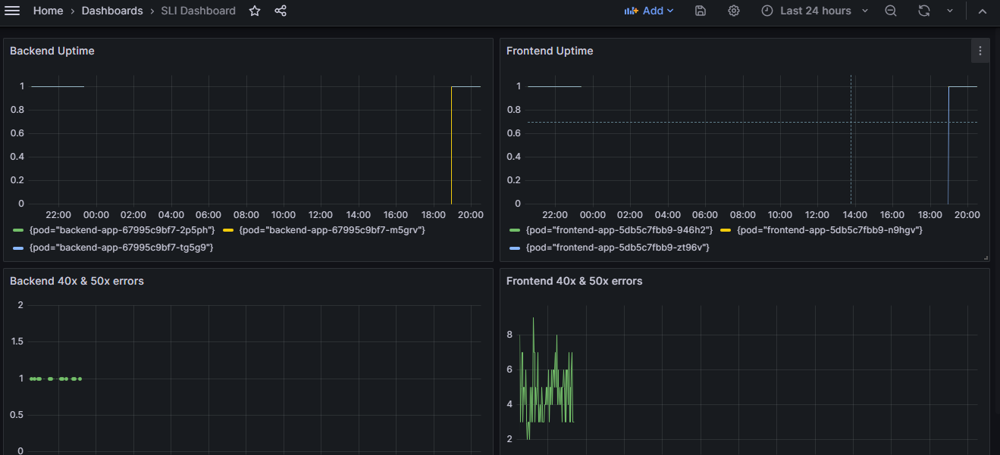

## Tracing our Flask App
We will create a Jaeger span to measure the processes on the backend. Once you fill in the span, provide a screenshot of it here. Also provide a (screenshot) sample Python file containing a trace and span code used to perform Jaeger traces on the backend service.

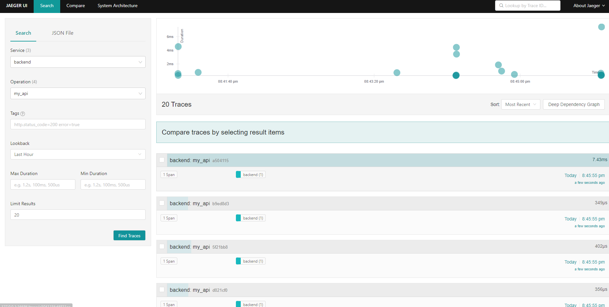
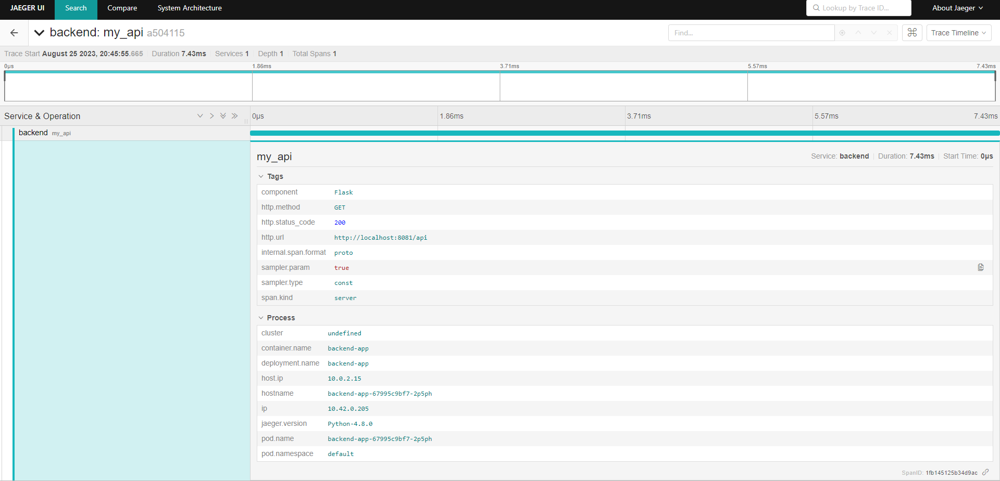
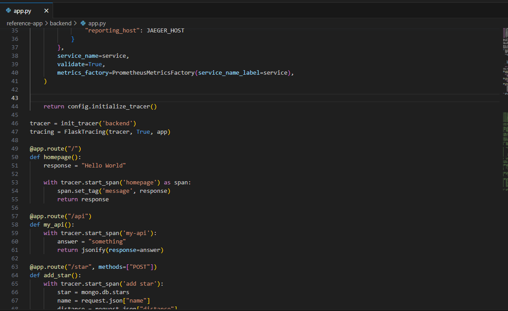

## Jaeger in Dashboards
Now that the trace is running, let's add the metric to our current Grafana dashboard. Once this is completed, provide a screenshot of it here.

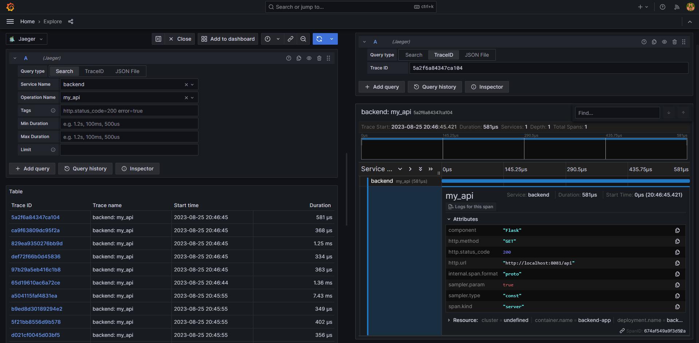

## Report Error
Using the template below, write a trouble ticket for the developers, to explain the errors that you are seeing (400, 500, latency) and to let them know the file that is causing the issue also include a screenshot of the tracer span to demonstrate how we can user a tracer to locate errors easily.

TROUBLE TICKET

* Name: trial service "status_code 500"

* Date: August 25 2023, 23:31:00

* Subject: Unable to get the requested job due to error in the application

* Affected Area:  "./reference-app/trial/app/app.py", line 62, in trace

* Severity: High

* Description: It is the error on the JSONDecodeError. The endpoint http://localhost:8082/trace service is not working. The server encountered an internal error and was unable to complete the request. Either the server is overloaded or there is an error in the application. 

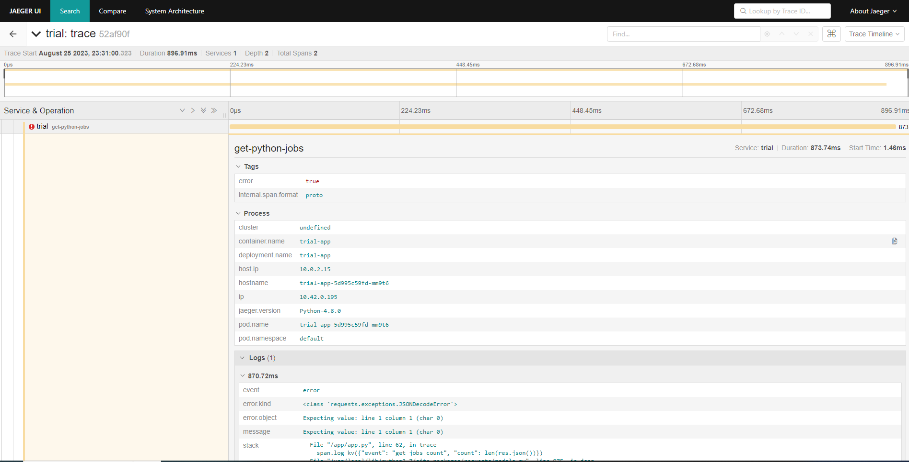

## Creating SLIs and SLOs
We want to create an SLO guaranteeing that our application has a 99.95% uptime per month. Name four SLIs that you would use to measure the success of this SLO.

* The number of redistributed traffic accross multiple data center (Peak traffic handling)
* The number and avarage duration of downtime incidents (the outages duration and the maximum frequency)
* The number of completed transaction, responsivness (Average response ti,me)
* The percentage of time that the service is available (Monthly uptime percentage of the application)

## Building KPIs for our plan
Now that we have our SLIs and SLOs, create a list of 2-3 KPIs to accurately measure these metrics as well as a description of why those KPIs were chosen. We will make a dashboard for this, but first write them down here.

**Latency:** Measures the average time that our application takes to respond to a customer request. This KPI helps us to maintain an average response time within a predefined threshold.

**Error rate:** The rate of error responses generated by the application or the percentage of responses that return an error code. This KPI serve as a root cause analysis and an early warning sign of potentail system failure or degradiation . Monitoring this KPI allows teams to take proactive measure to prevent widespead outages.

**Resource Utilization:** Monitors the degree of resource saturation in the appliation environment. This KPI helps us to maitain resource utilizaion below a defined saturation threshold.

## Final Dashboard
Create a Dashboard containing graphs that capture all the metrics of your KPIs and adequately representing your SLIs and SLOs. Include a screenshot of the dashboard here, and write a text description of what graphs are represented in the dashboard.  

## Graph Description
**Uptime:** The uptime of the backend and frontend services as they are fully operational for the last 24 hours.

**Memory Usage:** The memory usage of the backend and frontend services.

**CPU Usage:** The CPU usage of the backend and frontend services as measured over 30 seconds intervals.

**Average response time [30s]:** The average response time across the backend and frontend services measured over 30 seconds intervals for successful requests.

**Requests per second:** Number of successful requests per second across the backend and frontend services.

**Requests per minute:** Number of successful requests per minute across the backend and frontend services.

**Errors per second:** Number of failed (non HTTP 200) responses per second across the backend and frontend services categorized by error code.

**Flask HTTP request total:** Status "200:  Number of  HTTP 200 responses per second across the backend and frontend services categorized by success code.

**Total requests per minute:** The total number of requests measured over one minute intervals in the backend and frontend pods.

**Total received alerts:** The total number of alerts received by alertmanager.